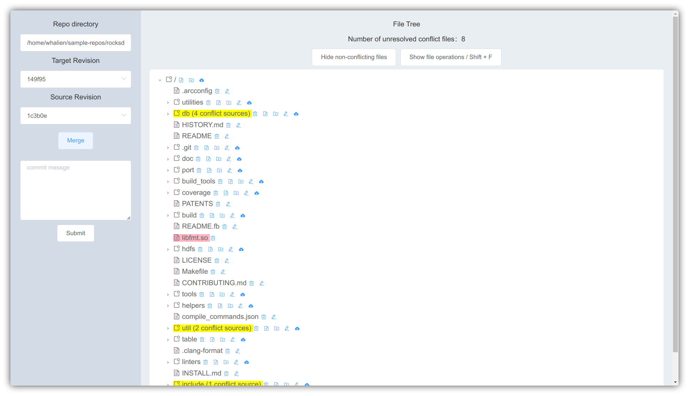
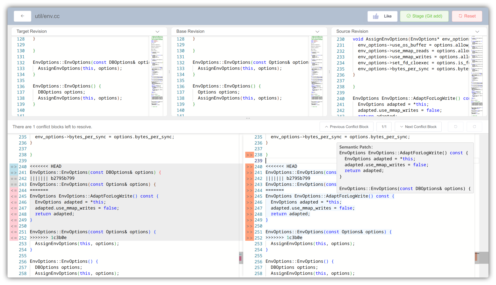
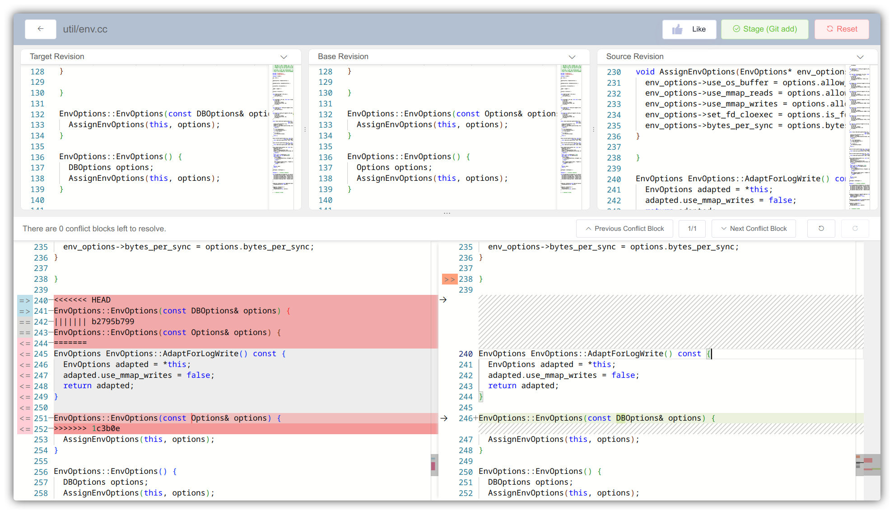
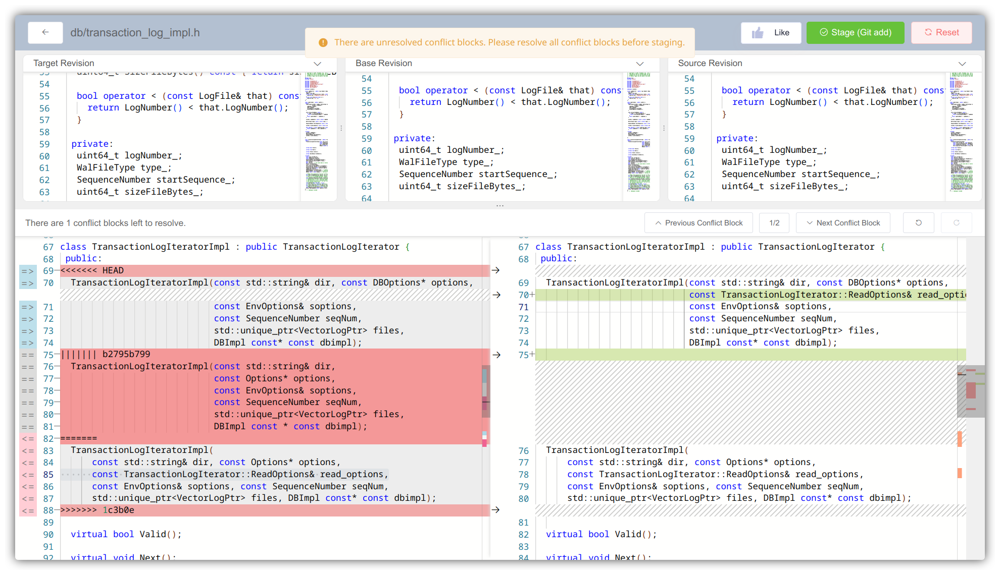

## MergeBot

A platform of semi-strucutred merge conflict resolution for C/C++ code. It internally uses MergeSyn (syntactic + synthesis) to recommend solutions for resolving C/C++ merge conflicts. This algorithm leverages [GLR parsing](https://tree-sitter.github.io/tree-sitter/) and the widely adopted [Language Server Protocol](https://microsoft.github.io/language-server-protocol/) to implement a semi-structured merging approach for C/C++. Additionally, it employs a method based on program synthesis and predefined rules as a more fine-grained supplement.

### Features

- **User-friendly Interface**: An interactive web app is designed to help users resolve large-scale merge conflicts more straightforward.
- **Conflict Resolution Recommendations**: Integrates semi-structured merging methods and program synthesis techniques to provide resolution strategies.
- **Proactive Error Prevention**: Utilizes character-level real-time diff display and proactive measures to minimize incorrect or forgotten conflict resolutions.
- **Extensive File Operation Support**: Supports various file operations, including creating, deleting, modifying, querying files and folders.
- **Seamless CI Integration**: Integrates with enterprise CI processes through Jenkins to enhance code integration efficiency.

### Preview

**File Tree**


**Resolution Recommendation**


**Real-time Diff between Pre- and Post- Resolution**


**Proactive Prevention**



### Usage

> **Note**: MergeBot was originally designed for integration into enterprise-level CI pipelines and supports only Unix-style paths. Consequently, it is compatible for deployment and use exclusively on macOS and Linux systems. On Windows, you can experience it using the Windows Subsystem for Linux (WSL) or a virtual machine.

#### Web App

1. **Prerequisites**
   Ensure that Docker and Docker Compose are installed on your system. If they are not installed, please refer to the [Docker installation guide](https://docs.docker.com/get-started/get-docker/) and the [Docker Compose installation guide](https://docs.docker.com/compose/install/).

2. **Project Preparation**
   MergeSyn, the resolution recommendation algorithm, relies on a [compile_commands.json](https://clang.llvm.org/docs/JSONCompilationDatabase.html) file for dependency analysis and semantic analysis due to the limitations of the C/C++ static analysis toolchain. For an optimal experience, it is recommended to use a project with the following characteristics:

    - Primary Language: C/C++
    - Buildable Version: At least one version that can be successfully built (used to generate compile_commands.json)
    - Merge Conflict Scenario: At least one merge conflict scenario

To prepare your project:

```shell
# clone a C/C++ project
git clone <C/C++ project repository> <project_path>
```

If the project uses CMake, generate compile_commands.json with:

```shell
cmake -Bbuild -DCMAKE_EXPORT_COMPILE_COMMANDS=ON -DCMAKE_BUILD_TYPE=Release .
```

If the project uses Make, generate compile_commands.json with:

```shell
bear -- make
```

MergeSyn will automatically detect the compile_commands.json file. If it is not found, the performance or functionality of the MergeSyn algorithm may be adversely affected.

Next, switch to a specific target version and merge another source version:

```shell
git checkout <target>
git merge <source>
```

3. **Run the Web App**
   After preparing the project, you can launch MergeBot using Docker Compose:

```shell
# Clone the MergeBot repository
git clone https://github.com/whaliendev/mergebot.git

# Navigate to the MergeBot project directory
cd <mergebot_project_path>

# Start Docker Compose
REPOS_DIR=<project_path> LOCAL_USER_ID=$(id -u) sudo -E docker compose up
```

4. **Access the Web App**
   Once the web app is running, access it via your browser at http://127.0.0.1:3000.

---

If the above instructions appear complex, you can use our pre-configured [setup script](./assets/prepare-repos.sh) to simplify project preparation and running the web app.

**Ensure Docker and Docker Compose are installed before executing the following commands:**

```shell
# Clone the MergeBot repository
git clone https://github.com/whaliendev/mergebot.git

# Navigate to the MergeBot project directory
cd <mergebot_project_path>

# Run the setup script
./assets/prepare-repos.sh
# For more information, use:
# ./assets/prepare-repos.sh --help

# Start the web app
REPOS_DIR=<project_path> LOCAL_USER_ID=$(id -u) sudo -E docker compose up
```

**Note:**

- If you leave the `REPOS_DIR` variable blank when running the setup script, the <project_path> for the web app should be set to `~/example-repos`.
- Alternatively, you can specify the `REPOS_DIR` variable with your desired directory when running the web app.

#### CLI

MergeSyn can also be used as a standalone command-line tool. To use MergeSyn, follow these steps:

1. **Prerequisites**
   Ensure that Docker and Docker Compose are installed on your system. If they are not installed, please refer to the [Docker installation guide](https://docs.docker.com/get-started/get-docker/) and the [Docker Compose installation guide](https://docs.docker.com/compose/install/).

2. **Project Preparation**
   Prepare your project as described in the Web App section. Either use the [setup script](./assets/prepare-repos.sh) or manually prepare your project.

3. **Run MergeSyn**

```shell
REPOS_DIR=<project_path> LOCAL_USER_ID=$(id -u) \
sudo -E \
docker run --rm \
  --name MergeSyn \
  -p 18080:18080 \
  -e LOCAL_USER_ID=${LOCAL_USER_ID} \
  -e REPOS_DIR=${REPOS_DIR} \
  -v ${REPOS_DIR}:${REPOS_DIR} \
  whalien52/mergebot-sa:v1.5.0
```

you also need to specify <project_path> to the directory containing the project you want to analyze.

4. **Access the CLI via REST API**
   Refer to the [API Documentation](docs/api-mergebot-sa.md) for more information on how to interact with the MergeSyn CLI.


### Build

Refer to [the Build Guide](docs/build-guide.md).


### Development

#### Frontend

Refer to [Frontend README](ui/frontend/README.md).

#### Backend

Refer to [Backend README](ui/conflict-manager/README.md).

#### MergeSyn

After configuring gcc, cmake, ninja, python, and conan according to [the Build Guide](docs/build-guide.md), in the current directory:

```shell
# install external dependencies, such as tree-sitter, Boost::graph, LLVM etc.
conan install . --build=missing -r=conancenter -s build_type=Debug

# cmake configure
cmake --preset conan-debug

# cmake build
cmake --build build/Debug
```

Change the `--preset` and `--build` options to `conan-release` and `build/Release` for release build.


> **Note**: This project also provides a developer-friendly interface for integration with other resolution recommendation algorithms. For example, our funder integrates learning-based methods and LLM-based methods to give recommendations across various languages in the AOSP project integration. You can refer to the integration guide in the [Frontend README](ui/frontend/README.md).


### LICENSE

[Apache 2.0](LICENSE)

<center>Copyright © 2024 HuaHe</center>

---

<p align="center"><b>If you like my project, feel free to give my repo a star~ :star: :arrow_up:. </b></p>
