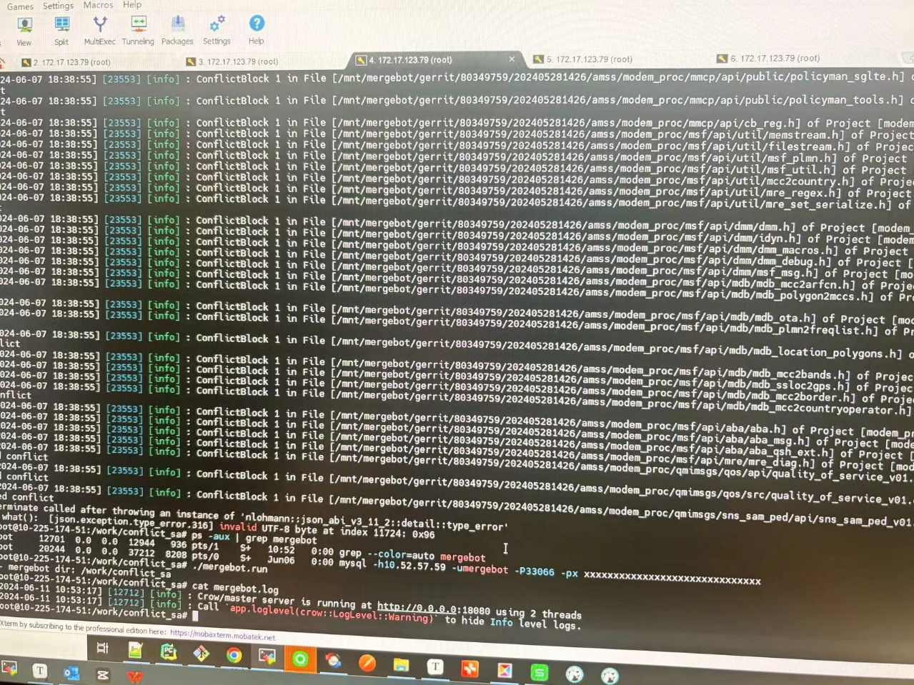

## 240611 解决方案说明
###  1. 问题
根据群里反馈的报错截图：

可以看到是一个 json 序列化相关的问题。但我们这边本地无法复现，所以暂时无法定位问题。

### 2. 问题分析
算法部分的 json 库主要用来和开源组件 clangd 通信。而报错信息又是反序列化的 schema 校验不通过，猜测问题可能是 clangd 进程挂掉了，导致发过来的消息不完整，Github 上有有类似的 [issue](https://github.com/clangd/clangd/issues?q=is%3Aissue+is%3Aopen+crash)。当 clangd 解析到一些非常复杂的或者不太标准的 C/C++ 写法的时候就会崩溃，开源组件上的问题我们短时间也无法修复。

### 3. 解决方案
一个可行的解决方案是，我们采用类似 k8s 风格的服务readiness probe。也就是用一个更稳定的服务去监控 mergebot 服务的 ready 状态。在 mergebot 服务挂掉后迅速将他拉起来。

> 因此，在本版本中，我们新增了一个监控程序 husky。该程序启动后会在后台监控 mergebot 的状态，在服务崩溃后迅速恢复服务正常状态并拉起服务。

**使用方法：**
确认服务器上已安装`kill, pkill, lsof, pgrep`四个命令。
启动服务：
```shell
./mergebot.run
```
和以往一致。

关闭服务：
```shell
./mergebot.shutdown
```
注意关闭服务和以往不同了。因为当 mergebot 作为前台进程挂了后，`husky` 会以后台进程的方式拉起服务，服务会继续响应。但是我们就无法简单的关掉服务了。（必须先 kill husky，然后再 kill mergebot，也就是./mergebot.shutdown脚本完成的任务）。
当然，如果 mergebot 还是运行在前台，则依旧可以通过`Ctrl + C`来关闭服务。